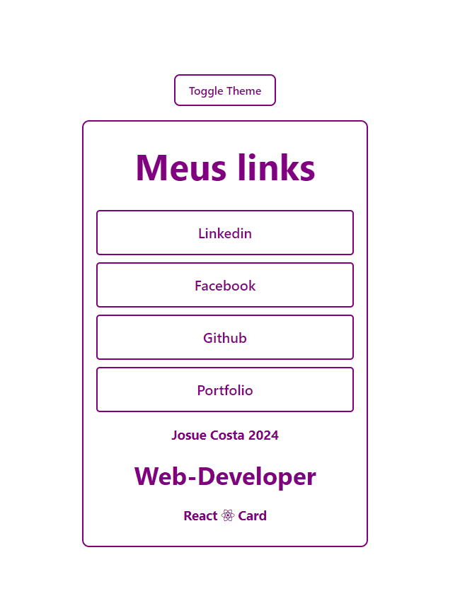

# React + Vite - CONTEXT-API
## Toggle Theme Button
## Como utilizar?
* Certifique-se de ter o Node.js e npm instalados em seu sistema. <br> Você pode baixá-los e instalá-los no site oficial do [Node.js](https://nodejs.org/en)<br> Em seu terminal realize os seguintes passos.
    * Clone o Repositorio: <br> 
        ```
        git clone https://github.com/JosueCosta2023/react-context-api-conceito.git
        ```
       
    * Instale as dependências do projeto: <br>
        ```
        npm install
        ```
        
    * Inicie o sistema: <br>
        ```
        npm start
        ```


 

 # Author
### Josué Ocanha Costa
#### FrontEnd Developer
#### Redes Sociais

- Linkedin - [JosueOcanhaCosta](https://www.linkedin.com/in/josue-ocanha-costa/)
- Github - [JosueCosta2023](https://github.com/JosueCosta2023)
- Twitter - [@JosueOcanhaCosta](https://twitter.com/josue_ocanha)
- Facebook - [JosueCosta](https://www.facebook.com/JosueOcanhaCosta2023)
- Whatsapp - [Josue2023](https://wa.me/5565996408371?text=Ol%C3%A1%2C+encontrei+seu+whatsapp+no+Github.+Gostaria+de+falar+sobre+seus+projetos.)

# "Vida longa e próspera. 🖖🖖🖖"